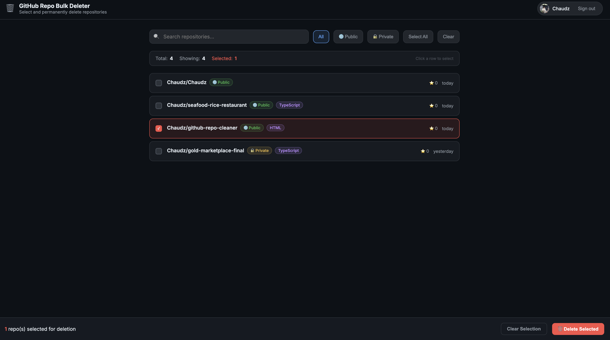

# GitHub Repo Bulk Deleter

A local web tool to **select and permanently delete multiple GitHub repositories in bulk**. Connect your account once, browse all your repos, tick the ones you want gone, and delete with one click.

> ⚠️ **Destructive operation.** Deleted repositories cannot be recovered. The tool requires you to type `DELETE` before anything is removed.

---

## Preview



> **Repo selection screen** — All your repositories loaded automatically. Filter by visibility, search by name, select with a single click. The floating action bar appears when repos are selected.

---

## Table of Contents

- [Features](#features)
- [Prerequisites](#prerequisites)
- [Installation](#installation)
- [Authentication](#authentication)
- [Usage](#usage)
- [CLI Mode](#cli-mode)
- [Project Structure](#project-structure)
- [Troubleshooting](#troubleshooting)
- [Security Notes](#security-notes)

---

## Features

| | |
|---|---|
| 🖥️ **Web UI** | Load all your repos visually — no URL typing needed |
| ☑️ **Checkbox selection** | Click to select individual repos or use Select All |
| 🔍 **Search & Filter** | Filter by name, description, public/private status |
| 🏷️ **Rich metadata** | See language, star count, last updated date per repo |
| 📡 **Real-time progress** | Server-Sent Events stream deletion status live |
| 🔒 **Two-step confirmation** | Must type `DELETE` before any repo is removed |
| 🧪 **CLI dry-run** | Preview what would be deleted without touching anything |
| ⚠️ **Clear error messages** | Per-repo failure reason (403, 404, 401) |

---

## Prerequisites

| Requirement | Version |
|-------------|---------|
| Node.js     | ≥ 18.x  |
| npm         | ≥ 9.x   |

---

## Installation

```bash
# 1. Clone the repository
git clone https://github.com/Chaudz/github-repo-cleaner.git
cd github-repo-cleaner

# 2. Install dependencies
npm install

# 3. (Optional) Set up environment file
cp .env.example .env
# Edit .env and set GITHUB_TOKEN=your_token_here
```

---

## Authentication

You need a **GitHub Personal Access Token (PAT)** with permission to delete repositories.

### Option A — Fine-grained token (Recommended)

1. Go to **[Settings → Developer settings → Fine-grained tokens](https://github.com/settings/tokens?type=beta)**
2. Click **Generate new token**
3. Set **Repository access** → `All repositories`
4. Under **Permissions → Repository permissions**:
   - **Administration** → `Read and write` ✅
5. Click **Generate token** and copy the value

### Option B — Classic token

1. Go to **[Settings → Tokens (classic)](https://github.com/settings/tokens/new)**
2. Select scope: ✅ `delete_repo`
3. Click **Generate token** and copy the value

---

## Usage

### Start the Web UI

```bash
npm run ui
```

Open **[http://localhost:3001](http://localhost:3001)** in your browser.

---

### Step-by-step

**Step 1 — Connect your account**

Paste your GitHub token into the input field and click **Load My Repositories**.
The tool verifies your token and fetches all repositories you own.

**Step 2 — Select repositories to delete**

Your repos are displayed as a list with metadata (visibility, language, stars, last updated).

- **Click any row** to select/deselect it
- Use **Search** to filter by name or description
- Use **Public / Private** filters to narrow down
- Click **Select All** to select every visible repo at once

**Step 3 — Delete**

When you have repos selected, a floating action bar appears at the bottom.
Click **Delete Selected**, then type `DELETE` in the confirmation dialog to proceed.

**Step 4 — Monitor progress**

Each repo is deleted sequentially with real-time status updates:
- ⏳ Deleting…
- ✅ Deleted
- ❌ Failed (with reason shown inline)

After completion, a summary shows total / deleted / failed counts.
Clicking **Done** reloads your repo list automatically.

---

## CLI Mode

If you prefer the terminal, the CLI tool (`index.js`) is still available.

### From a file

Create `repos.txt` with one GitHub URL per line:

```
# Lines starting with # are ignored
https://github.com/your-username/repo-1
https://github.com/your-username/repo-2
```

```bash
node index.js --file repos.txt
```

### Inline URLs

```bash
node index.js --urls https://github.com/user/repo1 https://github.com/user/repo2
```

### Pipe from stdin

```bash
cat repos.txt | node index.js
```

### Dry run (no deletion)

```bash
node index.js --file repos.txt --dry-run
```

### CLI Options

| Flag | Short | Description |
|------|-------|-------------|
| `--token <token>` | `-t` | GitHub Personal Access Token |
| `--file <path>` | `-f` | File containing repo URLs (one per line) |
| `--urls <url...>` | `-u` | URLs directly as arguments |
| `--yes` | `-y` | Skip confirmation prompts |
| `--dry-run` | — | Preview without deleting |
| `--help` | `-h` | Show help |

---

## Project Structure

```
.
├── index.js          # CLI entry point
├── server.js         # Express server (API + SSE streaming)
├── public/
│   └── index.html    # Web UI (single-page, no build step required)
├── repos.txt         # Example URL list for CLI mode
├── .env.example      # Environment variable template
├── .env              # Your local config (gitignored)
├── package.json
└── README.md
```

---

## Troubleshooting

### `Network error: Unexpected token '<'...`

Two server instances are running on the same port. Kill them and restart:
```bash
lsof -ti :3001 | xargs kill -9; npm run ui
```

### `403 Permission denied`

Your token is missing the required scope.
- **Classic token**: needs `delete_repo`
- **Fine-grained token**: needs `Administration → Read and write`

See [Authentication](#authentication) to create a new token.

### `404 Not found`

The repository was already deleted, the name is misspelled, or you don't have admin access to it.

### `401 Unauthorized`

Your token has expired or is invalid. Generate a new one and re-enter it.

### Port already in use

Change the port by setting the `PORT` environment variable:
```bash
PORT=4000 npm run ui
```

---

## Security Notes

- **Never commit your `.env` file** — it is listed in `.gitignore` by default.
- Your token is only used locally and sent directly to the GitHub API. It is never stored or logged by the server.
- Prefer **Fine-grained tokens** over Classic tokens for minimal permission scope.
- Revoke your token at [github.com/settings/tokens](https://github.com/settings/tokens) after use if it was created specifically for this tool.
